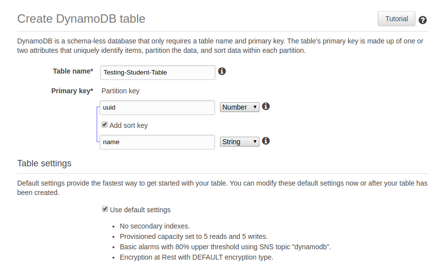
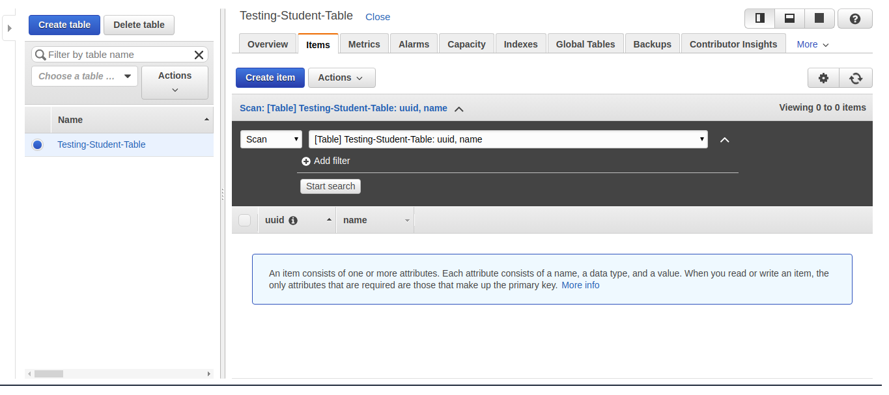
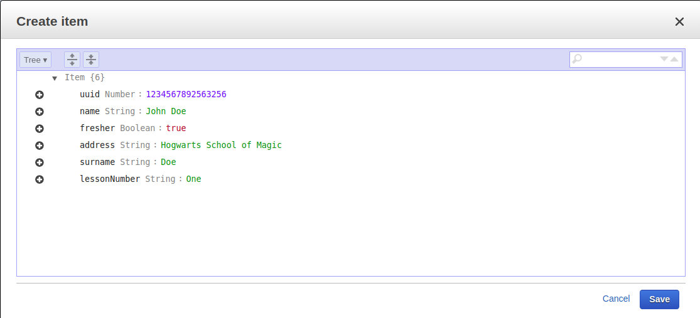

## Why this post ?

I am working with DynamoDB for some time now and on that journey I have explored about things that I would like to share. I am no master at Dynamo and nor does one needs to be for being able to utilize it's capacity. Here are most of the bare minimum things you need to know before jumping into starting to integrate DynamoDB to your application or before you chose it as a viable option. The post is pretty basic, and you can skip topics if you are well aware of them.

## What's a NoSQL aka Not Only SQL Database System ?

A NoSQL database provides you with the flexibility in managing data where you ideally don't need to stick to a predefined
schema for tabular storage. While NoSQL databases have stayed with us for a long time now, they became a thing in the era
of cloud, big data, and high volume web and mobile applications.

NoSQL databases are generally linked to:
 - High Scalability
 - High Availability
 - Big Data Storage Capacity
 - Easy Replication
 - Fast Performance

The above points sound so cool, but it's not entirely true for all the NoSQL databases and there are many more variables and architectural choices made which
provides you with them.

One mantra for NoSQL which I remind myself whenever I am switching from a relational system is, NoSQL is a denormalized
system and I must not think of the DB structure in a relational system. Try to flatten the data, and don't worry much if there's
a few data duplication. Like you don't go ahead and make a table to store schools when a student table is linked with a school.

## Some of the common categories of NoSQL databases

- **Key-Value Store**: They are essentially big hash tables of keys and values( Common examples are Dynamo DB and Redis).
- **Document-based Store**: The documents are made up of tagged elements(Common examples include MongoDB and CouchDB).
- **Column-Based Store**: They have storage blocks and each storage block contains data from only one column(HBase, Cassandra)
- **Graph-Based Store**: They are network-based, and uses edges and nodes to store/represent data(SAP Hana, Neo4J)

I know that's pretty boring stuff when you just read it, so I would advise to go ahead and see some of the data examples, of how they are stored and everything, will be clearer.

An Example of Data stored in a Key-Value Store:
```json
{
  "CarType": "Sedan",
  "Name": "Maserati Ghibli",
  "Price": "$10,000"
  <..other attributes>
},
{
  "CarType": "Hatchback",
  "Name": "Volkswagon Polo",
  "Price": "$5,000"
  <..other attributes>
}
```

## How to select the right DB to use ?

Though we already have a selection of DynamoDB in this post here, it's of great importance that you know what you are using and why. What comes in handy for choosing what you need is the popular CAP theorem by Eric Brewer for distributed systems. Since NoSQL databases are in generally largely distributed systems, people have used it in the selection of their NoSQL DB.

Coming to the theorem, it states that a networked shared data systems can only guarantee/strongly support two of the following three properties:

- **Consistency** — A guarantee that every node in a distributed cluster returns the same, most recent, successful write.
- **Availability** — Every non-failing node returns a response for all read and write requests in a reasonable amount of time.
- **Partition Tolerant** — The system continues to function and upholds its consistency guarantees in spite of network partitions.

Here's an image which is a nice depiction of the above 3 properties.

You can see that, DynamoDB provides us with Availability and Partition Tolerance, but doesn't guarantee Consistency. Although as of 2020 AWS has a strongly consistent and transactional consistent model, where AWS promises data consistency, it's not the best player in that area.

<br />

")

## Are you still unsure ?

Here's a list of questions, I copied from AWS documentation :wink:
These are just enough to decide if all the "Gyaan" above didn't work.

1. Can you organize your data in hierarchies or an aggregate structure in one or two tables?
2. Are traditional backups impractical because of table update rate or overall data size?
3. Does your database workload vary significantly by time or have high-traffic events?
4. Does your application or service consistently require response time in the single milliseconds?
5. Do you need to provide services in a scalable, replicated configuration?
6. Does your application need to store data in the high-terabyte size range?
7. Are you willing to invest in a short but possibly steep NoSQL learning curve?
8. Is data protection important?

Those questions are really the marketing ones. But hey, AWS promises you something. I will add another one:

9. Are you on AWS cloud services already?
You can obviously use it from other services like a GCP, but that won't be secure on the go.

## Introducing the already introduced DynamoDB

Amazon DynamoDB is a key-value based NoSQL database which is highly scalable, reliable, fully managed and durable database with built-in security, backup and restore, and in-memory caching for internet-scale applications

By fully managed they mean, you don’t need to worry about the underlying hardware, servers, or operating system.

Data stored in the DynamoDB is redundantly copied across multiple Availability Zones and thus it protects data loss due to underlying hardware failures by default, which is a big thing.

In simple terms, you can say that DynamoDB can handle a large amount of data and large traffic without you worrying about the architecture behind, and can be integrated to your application like butter with the AWS ecosystem.


## Data Organisation and Modelling

DynamoDB organizes data as tables, yes tables. Each table contains several items in each row, and each item has keys and values for each column.

UUID (Primary Key)  | StudentName  | MathsScore  | BioScore  | AccountsScore
--------------------|--------------|-------------|-----------|---------------
1212-3322-5861-9865 | Ram          | 59          | 98        |
1582-2249-9513-6538 | Shyam        | 79          |           | 89

In the example above, one item can be represented in JSON data as:
```json
{
  "UUID": 1212-3322-5861-9865,
  "StudentName": 'Ram',
  "MathsScore": 59,
  "BioScore": 98
}
```
What's different about a DynamoDB table is that you have the freedom to select a
primary key while keeping all other columns dynamic. So in the above example, you can keeping adding different kinds of scores or any other information.

You just define the primary key and data can be added with a dynamic set of keys and values.

### Primary Keys

When you create a table in DynamoDB, in addition to the table name, you must specify the primary key of the table. The primary key uniquely identifies each item in the table, so that no two items can have the same key.

A dynamo primary key is either based on a single field or a couple of fields.

- Partition key – A simple primary key, composed of one attribute known as the partition key. DynamoDB uses the partition key's value as input to an internal hash function. The output from the hash function determines the partition (physical storage internal to DynamoDB) in which the item will be stored.

- Partition key and sort key - Referred to as a composite primary key, and as the name suggests it is composed of two attributes. The first attribute is the partition key, and the second attribute is the sort key. All items with the same partition key value are stored together, in sorted order by sort key value.

Let's add a sort key on the previous example:

UUID (Partition Key)  | StudentName (Sort Key)  | MathsScore  | BioScore  | AccountsScore
----------------------|-------------------------|-------------|-----------|---------------
1212-3322-5861-9865   | Ram                     | 59          | 98        |
1582-2249-9513-6538   | Shyam                   | 79          |           | 89


When you have a composite primary key, the uniqueness is checked on the pair of
partition and sort keys, so in the above example we have UUID, but uniqueness is only checked on UUID and StudentName together as a unit, so one can also store another record with the same UUID and a different StudentName.

The selection of a wise primary key is very important as the DB is indexed on your primary key and provides with a quick result when you try to find by an indexed field. And this selection is one of the places where your most of the thinking should go when you are modeling your data.

### Data types supported are:

- Scalar Types : Number, String, Binary, Boolean and Null.
- Document Types : List and Map
- Set Types : Number Set, String Set, and Binary Set.

You don't need to define them while creating any item, it's just for a reference on what data types can be stored.

## Creating a table in AWS Console

1. Visit the AWS console page.
2. Select DynamoDB from the services menu and click on the create table option.
3. You have a small form, asking for the table name and primary key.
4. Use the defaut options for now and click on create Table button.
    - When you are creating a table you can provide partition key and an optional sort key, an important point to note is that these columns can’t be changed.

    - You can update the attributes of any item in dynamo, but can never update a key if you ever want to, what you do is you delete the item and then re-create another one with a different key.



5. You will see a screen like below


6. Visit the items tab, there's no item there, you will be using AWS API endpoints to fetch,create, update, delete items from your app but for now just go ahead and create your first item by clicking on Create Item :smile:



You can see how you can add other dynamic sets of keys and add their values on the go.

Keep exploring the console options and you will get some hold on what it is.

## How to get started ?

Checkout AWS SDK for DynamoDB which is supported for several languages, and can be used to interact with DynamoDB API endpoints for basic DB operations seamlessly. You can also read my next post which will be more about the usage part of it.

## Last words until the next one
DynamoDB is one of the easiest no-sql databases to start working with, but as you keep exploring you can dive deeper into understanding its capabilities. In a follow-up article, I will be writing about indexes, read and write capacity units, API functions, and I will give a walkthrough on how you can use AWS APIs to create and manage a DyanmoDB table and show some CRUD operations.

## References
Here are a few links this article takes inspiration from.

https://docs.aws.amazon.com/amazondynamodb/latest/developerguide/Introduction.html (AWS ecosystem example image)
https://docs.aws.amazon.com/amazondynamodb/latest/developerguide/HowItWorks.CoreComponents.html
https://medium.com/tensult/core-concepts-of-amazon-dynamodb-a265a3fc70a
https://opensourceforu.com/2017/05/different-types-nosql-databases/
https://www.3pillarglobal.com/insights/exploring-the-different-types-of-nosql-databases
https://www.mysoftkey.com/architecture/understanding-of-cap-theorem/  (CAP Theorem Diagram)
https://www.geeksforgeeks.org/introduction-to-nosql/
